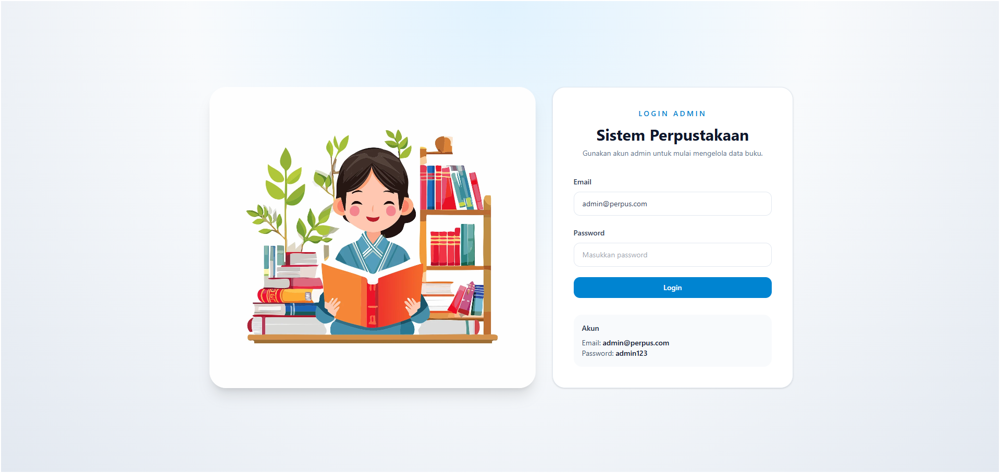
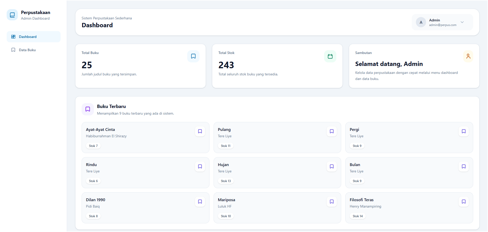
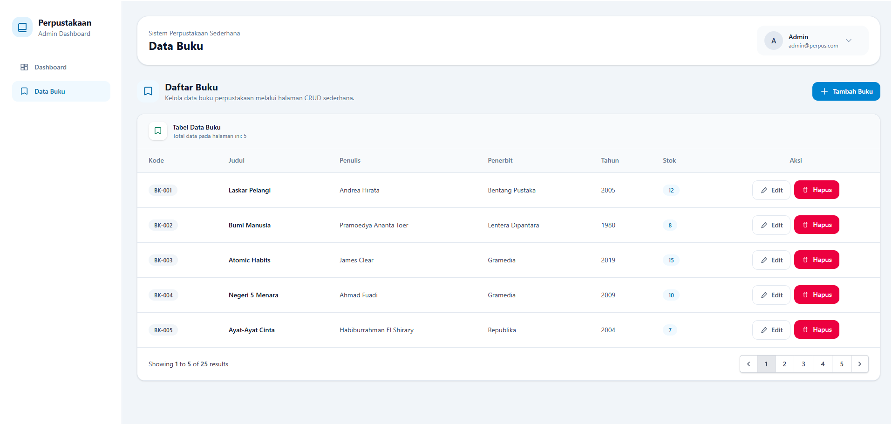

# Sistem Perpustakaan Sederhana

## Identitas Mahasiswa

- **Nama:** Laila Kaltsum Hafizhah Salma  
- **NIM:** 220101060  
- **Program Studi:** S1 Sistem Informasi  
- **Kelas:** 22A2  

---

## Tema Kasus

Aplikasi ini mengangkat tema **Sistem Perpustakaan Sederhana** berbasis web menggunakan framework Laravel.

Sistem ini dibuat untuk membantu admin dalam mengelola data buku perpustakaan secara digital, sehingga proses pencatatan buku menjadi lebih cepat, rapi, dan efisien.

---

## Latar Belakang

Pada perpustakaan, pengelolaan data buku masih sering dilakukan secara manual, sehingga berisiko terjadi kesalahan pencatatan dan sulit dalam pencarian data.

Oleh karena itu, dibuatlah sistem perpustakaan berbasis web yang dapat membantu proses pengelolaan data buku secara lebih terstruktur.

---

## Tujuan Sistem

Tujuan dari pembuatan sistem ini adalah:

- Mempermudah admin mengelola data buku
- Menyimpan data buku secara terkomputerisasi
- Menyediakan sistem login yang aman
- Menampilkan dashboard informasi secara sederhana
- Melatih implementasi CRUD menggunakan Laravel

---

## Fitur Utama

- Login Admin
- Dashboard
- Menampilkan jumlah buku
- CRUD Data Buku
- Logout
- Session Authentication

---

## Halaman Sistem

### 1. Halaman Login

Halaman login digunakan admin untuk masuk ke dalam sistem menggunakan email dan password.

---

### 2. Halaman Dashboard

Dashboard menampilkan informasi singkat seperti jumlah buku, stok buku, dan buku terbaru.

---

### 3. Halaman Data Buku

Halaman ini digunakan untuk mengelola data buku seperti tambah, edit, dan hapus buku.

---

## Teknologi yang Digunakan

- Laravel
- PHP
- MySQL
- Tailwind CSS
- Blade Template

---

## Akun Login Default

- **Email:** admin@perpus.com  
- **Password:** admin123

---

## Kesimpulan

Sistem Perpustakaan Sederhana ini dapat membantu admin dalam mengelola data buku dengan lebih mudah, cepat, dan rapi. Sistem ini juga menerapkan autentikasi login dan fitur CRUD sesuai kebutuhan tugas UJK.